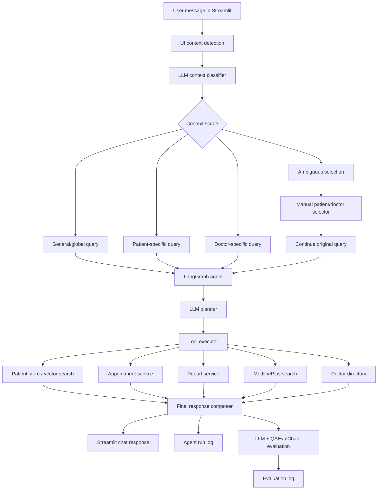

# Sourav Healthcare Capstone Project Documentation

## 1. Project Overview

**Project name:** `sourav_healthcare_capstone`

**Application type:** Python Streamlit web application

**Primary goal:** Build an agentic healthcare assistant that can automate and support medical administrative workflows such as patient record lookup, medical report retrieval, appointment booking, doctor lookup, general symptom advice, patient history management, and agent traceability.

**Preferred environment:** macOS with VS Code

**Core stack:**

- Python
- Streamlit
- LangGraph
- LangChain
- OpenAI chat models
- LangChain `QAEvalChain`
- FAISS-backed local retrieval
- Excel and PDF ingestion
- JSON-based lightweight persistence

**Safety scope:** The assistant is for administrative and educational support only. It does not diagnose, prescribe, or replace licensed clinical care.

---

## 2. Business Problem

Healthcare teams often spend significant time on repetitive operational tasks:

- Searching patient history
- Reading or summarizing medical reports
- Matching symptoms to appropriate specialists
- Booking and managing appointments
- Reviewing doctor availability
- Maintaining patient history over time
- Answering general healthcare administration questions

This project addresses those needs by combining patient records, medical report ingestion, LLM planning, tool execution, retrieval, and UI workflows into one agentic assistant.

---

## 3. High-Level Capabilities

The system currently supports:

- Conversational healthcare assistant UI
- Patient context detection and manual context selection
- Generic questions not tied to any patient
- System-wide appointment queries
- Doctor directory queries
- Doctor-specific appointment queries
- Patient-specific appointment queries
- Guided appointment booking inside the chat flow
- Symptom-to-specialty reasoning through the LLM
- Doctor and date selection through UI controls
- Past-date prevention in calendar-based booking
- Patient medical report upload
- Manual patient history note creation
- Automatic storage of patient-context chat turns into patient history
- Patient record ingestion from Excel and PDFs
- Patient deduplication during runtime loading
- Report/test-result retrieval from stored records
- General medical information lookup through MedlinePlus
- LLM-driven planning with LangGraph
- Evaluation with structured scoring and `QAEvalChain`
- Agent run logs and evaluation logs
- Editable patient and doctor tables
- Excel import/export for patient and appointment data

---

## 4. Repository Layout

```text
sourav_healthcare_capstone/
├── app.py
├── requirements.txt
├── README.md
├── PROJECT_DOCUMENTATION.md
├── data/
│   ├── 1754386259_capstone_problem_statement_agentic_healthcare_assistant_for_medical_task_automation.pdf
│   ├── records.xlsx
│   ├── sample_patient.pdf
│   ├── sample_report_anjali.pdf
│   ├── sample_report_david.pdf
│   ├── sample_report_ramesh.pdf
│   ├── doctors_schedule.json
│   ├── appointments.json
│   └── user_records.json
├── logs/
│   ├── agent_runs.jsonl
│   └── evaluation_results.jsonl
├── src/
│   ├── agent_graph.py
│   ├── appointment_service.py
│   ├── config.py
│   ├── data_loader.py
│   ├── disease_search.py
│   ├── evaluator.py
│   ├── llm_service.py
│   ├── logger.py
│   ├── models.py
│   ├── patient_store.py
│   ├── pdf_parser.py
│   ├── prompts.py
│   ├── record_service.py
│   ├── report_service.py
│   └── vector_store.py
└── tests/
    ├── test_agent_flow.py
    └── test_patient_lookup.py
```

---

## 5. Setup Guide for macOS and VS Code

### 5.1 Open Project

Open this folder in VS Code:

```bash
/Users/sourav/Documents/VSCode/GenAI/sourav_healthcare_capstone
```

### 5.2 Create Virtual Environment

```bash
cd /Users/sourav/Documents/VSCode/GenAI/sourav_healthcare_capstone
python3 -m venv .venv
source .venv/bin/activate
```

### 5.3 Install Dependencies

```bash
pip install -r requirements.txt
```

### 5.4 Configure OpenAI

Create a local `.env` file or export variables in the terminal.

```bash
export OPENAI_API_KEY="your-key-here"
export OPENAI_MODEL="gpt-4.1-mini"
```

Do not commit real API keys to source control.

### 5.5 Run Application

```bash
streamlit run app.py
```

Default local URL:

```text
http://localhost:8501/
```

---

## 6. Runtime Architecture



---

## 7. Application UI

The UI is implemented in `app.py` using Streamlit.

### 7.1 Main Tabs

The application has these primary tabs:

- **Assistant**
- **Patients**
- **Appointments**
- **Agent Trace**
- **Evaluation**

### 7.2 Assistant Tab

The Assistant tab is split into:

- Central chat area
- Right-side session workspace
- Run details below the chat input

The chat area contains:

- Conversation history
- Message input
- Close patient session controls
- Tool count
- Evaluation score
- Planning breakdown
- Tool logs

The right-side workspace contains:

- Patient context selector
- Patient context summary
- Ambiguity resolution selectors
- Appointment controls
- Add-to-history form
- Medical report upload
- Compact next-best-action suggestions

### 7.3 Patients Tab

The Patients tab supports:

- Viewing patient records
- Editing patient summaries
- Uploading patient Excel files
- Uploading medical PDFs
- Exporting patient data to Excel

### 7.4 Appointments Tab

The Appointments tab supports:

- Viewing current appointments
- Exporting appointment data
- Viewing doctor schedules
- Editing doctor data
- Importing/exporting schedule information

### 7.5 Agent Trace Tab

The Agent Trace tab reads from:

```text
logs/agent_runs.jsonl
```

It is used to inspect:

- User query
- Generated plan
- Tool calls
- Tool outcomes
- Final answer

### 7.6 Evaluation Tab

The Evaluation tab reads from:

```text
logs/evaluation_results.jsonl
```

It shows:

- Evaluation scores
- Tool success rates
- Appointment success indicators
- Patient lookup indicators
- LLM evaluator output where available

---

## 8. Context Model

The assistant supports multiple conversational scopes.

### 8.1 General Context

Used when the query is not tied to a patient or doctor.

Examples:

```text
What is the time now?
I have knee pain, what should I do?
```

### 8.2 Global/System Context

Used when the query applies to the whole system.

Examples:

```text
Show all appointments.
Show all doctors in the system.
Show doctors with active appointments.
```

### 8.3 Patient Context

Used when the query is about one patient.

Examples:

```text
Show Ramesh's last symptoms.
Show test results for Ramesh.
Book an appointment for Anjali.
```

### 8.4 Doctor Context

Used when the query is about one doctor.

Examples:

```text
Who is Kavita?
Show appointments for Dr. Kavita Menon.
```

### 8.5 Pending Selection Context

Used when the system finds multiple possible matches or cannot safely identify the patient.

Example:

```text
Who is Kavita?
```

If both a patient and doctor match, the UI asks the user to choose.

### 8.6 Appointment Workflow Context

Used during guided appointment booking.

The workflow tracks:

- Patient
- Problem or symptoms
- Suggested specialty
- Suggested doctor
- User-selected doctor
- Preferred date
- Available slots
- Booking confirmation

---

## 9. LLM and LangGraph Design

The agentic workflow is implemented mainly in:

```text
src/agent_graph.py
src/llm_service.py
```

### 9.1 LLM Planning

`src/llm_service.py` defines structured Pydantic outputs for planning.

Important classes:

- `AgentPlan`
- `PlanStep`
- `ContextDecision`
- `ReportIntent`
- `EntityLookupIntent`
- `PatientRecordQuestionIntent`
- `SpecialtyDecision`
- `SafetyTriage`
- `NextBestActions`

The planner can select tasks such as:

- `retrieve_patient_context`
- `list_appointments`
- `list_all_appointments`
- `list_doctor_appointments`
- `list_active_appointment_doctors`
- `list_doctors`
- `lookup_entity_details`
- `book_appointment`
- `clear_appointments`
- `retrieve_medical_information`
- `retrieve_patient_reports`
- `answer_general`
- `final_response`

### 9.2 LangGraph Flow

`src/agent_graph.py` builds a LangGraph with:

- `llm_planner`
- `tool_executor`

Flow:

```text
llm_planner -> tool_executor -> END
```

The planner generates the structured plan. The tool executor performs local data access, appointment actions, report retrieval, medical info retrieval, and final response assembly.

### 9.3 LLM Context Classification

Before running the agent, `app.py` calls context classification logic. The LLM decides whether a query is:

- `general`
- `global`
- `patient`
- `doctor`

This prevents system-wide queries from incorrectly asking for a patient.

### 9.4 LLM Patient Record Q&A

For targeted patient history questions, the assistant uses:

```text
answer_patient_record_question()
```

This function receives only the selected patient's context and is instructed to answer only the requested item instead of dumping the full patient profile.

### 9.5 LLM-Based Specialty Selection

Appointment booking uses an LLM classifier to infer the relevant specialty from symptoms and available specialties.

Example:

```text
Ramesh has knee pain.
```

The LLM should route this toward an orthopedic or musculoskeletal specialist if one is available, or a suitable fallback if not.

### 9.6 LLM Safety Triage

The assistant can add urgent action guidance for concerning symptoms. For example, chest pain should include safety guidance such as seeking urgent care, depending on the LLM triage output.

---

## 10. RAG and Retrieval

The system includes a local retrieval layer in:

```text
src/vector_store.py
```

### 10.1 Vector Store

`SimpleVectorStore` builds deterministic local embeddings using hashed tokens and optionally stores them in a FAISS index.

It supports:

- Patient search
- Fallback patient matching
- Local retrieval without downloading external embedding models

### 10.2 RAG Usage

The system uses retrieval in two main ways:

- Patient lookup from records when the exact patient is not supplied
- Patient-context grounding for record-based responses

For general treatment information, it does not currently build a local treatment vector index. Instead, it calls MedlinePlus live search through `src/disease_search.py`. If MedlinePlus is unavailable, it returns a trusted-source-unavailable message rather than inventing medical content.

---

## 11. Data Sources

### 11.1 Excel Records

Main file:

```text
data/records.xlsx
```

Loaded by:

```text
src/data_loader.py
```

Expected columns include:

- `Name`
- `Age`
- `Gender`
- `Phone_number`
- `Email`
- `Address`
- `Summary`

### 11.2 PDF Medical Reports

Sample PDF files:

```text
data/sample_patient.pdf
data/sample_report_anjali.pdf
data/sample_report_david.pdf
data/sample_report_ramesh.pdf
```

Parsed by:

```text
src/pdf_parser.py
```

### 11.3 User-Created Records

Persistent user-added records are stored in:

```text
data/user_records.json
```

Managed by:

```text
src/record_service.py
```

This file stores:

- Manual patient records
- Uploaded medical records
- Patient history entries
- Chat-derived patient history notes

### 11.4 Doctors and Schedules

Doctor schedule file:

```text
data/doctors_schedule.json
```

Managed by:

```text
src/appointment_service.py
```

### 11.5 Appointments

Appointment file:

```text
data/appointments.json
```

Managed by:

```text
src/appointment_service.py
```

---

## 12. Patient Record Management

Patient record management is implemented through:

```text
src/patient_store.py
src/record_service.py
src/data_loader.py
src/pdf_parser.py
```

### 12.1 Runtime Loading

The runtime loads records from:

- `records.xlsx`
- sample PDF reports
- `user_records.json`

The current runtime loader is cached with:

```python
@lru_cache(maxsize=1)
```

This prevents constant reloading during a single app session. When new records are added, the app clears the runtime cache and rebuilds the in-memory store.

### 12.2 Deduplication

Deduplication is handled by:

```text
deduplicate_patient_records()
```

The matching logic considers:

- Phone number
- Normalized patient name
- Age
- Gender

When duplicate records are detected, they are merged into one patient object with linked source documents.

### 12.3 Linked Records

Merged patient records keep a `source_documents` list in metadata. This preserves the source of each imported record while presenting a unified patient context.

### 12.4 Patient History Entries

Patient-context chat turns and manual notes are stored as `patient_history_entry` records in `user_records.json`.

Examples of entry types:

- `symptoms`
- `medical_history`
- `advice`
- `treatment`
- `appointment_note`
- `general_note`

---

## 13. Medical Report Handling

Medical report retrieval is implemented in:

```text
src/report_service.py
```

The report service:

- Finds matching patient records
- Extracts linked source documents
- Filters for report-like sources
- Parses sections such as Diagnosis, Subjective, Objective, Assessment, and Plan
- Formats reports into structured Markdown tables and bullet lists

Supported report queries include:

```text
Show Ramesh's test results.
Show all medical reports for Anjali.
Does David have uploaded reports?
```

If no reports are found, the assistant says that no stored reports or test results are available and suggests uploading a record.

---

## 14. Appointment Management

Appointment logic is implemented in:

```text
src/appointment_service.py
```

### 14.1 Supported Appointment Actions

- List patient appointments
- List all appointments
- List appointments for a doctor
- List doctors with active appointments
- Clear all appointments
- Check slots by specialty
- Book a specific appointment

### 14.2 Guided Booking Flow

The appointment flow is conversational:

1. User asks to book an appointment.
2. System identifies or asks for patient.
3. System asks for symptoms if missing.
4. LLM suggests a specialty.
5. UI shows available doctors and specialties.
6. User selects doctor.
7. User selects a calendar date.
8. System checks exact and alternate availability.
9. User confirms slot.
10. Appointment is saved to `data/appointments.json`.

### 14.3 Date Validation

The UI uses a date selector and prevents selecting past dates.

---

## 15. Medical Information Search

Medical education lookup is implemented in:

```text
src/disease_search.py
```

The system calls the MedlinePlus API:

```text
https://wsearch.nlm.nih.gov/ws/query
```

Returned HTML snippets are cleaned before being shown to the user.

If the live lookup is unavailable, the assistant does not invent medical information. It returns a message asking the user to consult trusted sources such as MedlinePlus, WHO, CDC, or a clinician.

---

## 16. Evaluation and Monitoring

Evaluation is implemented in:

```text
src/evaluator.py
```

Logs are written to:

```text
logs/evaluation_results.jsonl
```

### 16.1 Heuristic Score

The fallback evaluator scores:

- Whether an answer exists
- Whether patient lookup succeeded when needed
- Tool success rate
- Appointment booking success when appointment was requested
- Medical information retrieval when requested

### 16.2 LLM Evaluation

When an OpenAI key is configured, the system also calls an LLM evaluator for:

- Relevance
- Groundedness
- Tool success
- Safety
- Critique

### 16.3 QAEvalChain

The app uses:

```text
langchain.evaluation.qa.QAEvalChain
```

The chain compares the final answer against tool context or reference output.

### 16.4 Missing Evaluation Metadata

Older saved turns or manually generated chat events may not include evaluation metadata. In that case, the UI shows `N/A` for the score instead of displaying an error.

---

## 17. Logging

Agent run logs are stored in:

```text
logs/agent_runs.jsonl
```

Each run can contain:

- Query
- Plan
- Patient lookup result
- Appointment result
- Appointment list
- Doctor list
- Entity matches
- Medical info result
- Patient reports
- Tool logs
- Final answer

Evaluation logs are stored separately in:

```text
logs/evaluation_results.jsonl
```

---

## 18. Important Modules

### 18.1 `app.py`

Main Streamlit application.

Responsibilities:

- UI layout
- Chat rendering
- Session state
- Patient context selection
- Ambiguity resolution
- Appointment UI controls
- Upload forms
- Excel import/export
- Agent trace and evaluation dashboards

### 18.2 `src/agent_graph.py`

Main agent orchestration layer.

Responsibilities:

- Runtime loading
- LangGraph construction
- LLM plan normalization
- Tool execution
- Final response assembly
- Agent logging
- Evaluation triggering

### 18.3 `src/llm_service.py`

LLM interface and structured output models.

Responsibilities:

- OpenAI model configuration
- Structured planning
- Context classification
- Report intent classification
- Entity lookup classification
- Patient record Q&A
- Specialty routing
- Safety triage
- Next-best-action generation

### 18.4 `src/patient_store.py`

Patient storage and deduplication.

Responsibilities:

- Patient listing
- Patient lookup
- Fuzzy name matching
- Duplicate merge logic
- Source document tracking

### 18.5 `src/appointment_service.py`

Appointment and doctor schedule service.

Responsibilities:

- Load/save doctors
- Load/save appointments
- List appointments
- Find doctors
- Find slots
- Book appointments
- Clear appointments

### 18.6 `src/report_service.py`

Report retrieval and formatting helper.

Responsibilities:

- Retrieve patient reports
- Extract report sections
- Identify report-like documents
- Return structured report objects

### 18.7 `src/vector_store.py`

Local retrieval layer.

Responsibilities:

- Build hashed embeddings
- Build FAISS index if available
- Retrieve likely patient records

### 18.8 `src/evaluator.py`

Evaluation layer.

Responsibilities:

- Heuristic scoring
- LLM scoring
- `QAEvalChain` evaluation
- Evaluation log writing

---

## 19. Example User Flows

### 19.1 Generic Question

```text
User: What is the time now?
System: Uses general LLM answer path and current system time.
```

### 19.2 Global Appointment Query

```text
User: Show me all appointments.
System:
- Classifies query as global
- Calls list_all_appointments
- Returns every appointment without asking for a patient
```

### 19.3 Patient Test Results

```text
User: Show all test results for Ramesh.
System:
- Classifies as patient report retrieval
- Finds Ramesh
- Calls report service
- Formats stored reports into sections
```

### 19.4 Doctor Lookup

```text
User: Who is Kavita?
System:
- Searches both doctors and patients
- Shows a direct doctor result if unambiguous
- Shows choices if multiple matches are found
```

### 19.5 Appointment Booking

```text
User: Book appointment for Ramesh, he has knee pain.
System:
- Detects patient
- Uses LLM to infer specialty
- Shows doctor and calendar controls
- Checks slots
- Books after slot confirmation
```

### 19.6 Patient History Query

```text
User: What were the last symptoms for Ramesh?
System:
- Builds Ramesh-only patient context
- Uses LLM patient-record Q&A
- Answers only the requested item
```

---

## 20. Data Persistence

Current persistence is lightweight and file-based:

| Data | File |
|---|---|
| Base patient Excel records | `data/records.xlsx` |
| Uploaded/manual patient records | `data/user_records.json` |
| Doctor schedules | `data/doctors_schedule.json` |
| Booked appointments | `data/appointments.json` |
| Agent traces | `logs/agent_runs.jsonl` |
| Evaluations | `logs/evaluation_results.jsonl` |

This is suitable for a capstone prototype. For production, a lightweight database such as SQLite would be a better next step.

---

## 21. Known Technical Caveats

The project is LLM-driven for planning, classification, specialty reasoning, patient-record answering, safety triage, and evaluation, but some local deterministic logic remains where it is appropriate for system operations.

Examples:

- JSON file reads/writes
- Exact appointment saving
- Calendar date validation
- Doctor slot lookup
- Patient deduplication scoring
- Local fallback patient matching
- Report section parsing
- UI state management

These are not clinical decision rules. They are operational mechanics needed to safely execute the LLM's plan against local data.

---

## 22. Security and Privacy Notes

This is a local prototype and should not be treated as production-ready for protected health information.

Important considerations:

- Do not commit real API keys.
- Do not upload real patient data without proper consent and safeguards.
- JSON files are not encrypted.
- Logs can contain user queries and patient-related content.
- OpenAI API calls may send prompt context to the configured model provider.
- A production system should add authentication, authorization, encryption, audit controls, retention policies, and PHI-safe deployment practices.

---

## 23. Testing

Current test files:

```text
tests/test_agent_flow.py
tests/test_patient_lookup.py
```

Recommended commands:

```bash
python -m compileall app.py src
python -m pytest
```

Current practical validation approach:

- Compile `app.py` and `src`
- Run Streamlit locally
- Exercise chat queries in the browser
- Inspect Agent Trace tab
- Inspect Evaluation tab
- Check `logs/agent_runs.jsonl`
- Check `logs/evaluation_results.jsonl`

---

## 24. Requirement Traceability Summary

| Requirement Area | Current Implementation |
|---|---|
| Agentic healthcare assistant | Implemented with Streamlit, LangGraph, and tool execution |
| LLM planning | Implemented in `src/llm_service.py` and `src/agent_graph.py` |
| Prompt chains for summarization/planning/action triggering | Implemented through structured LLM planning, patient Q&A, specialty classification, safety triage, and next-best-action generation |
| Patient context memory lookup | Implemented through patient context selection, patient store, linked records, and session state |
| RAG pipeline | Partially implemented through local patient vector retrieval and patient-context grounding |
| Treatment option search/summarization | Implemented through live MedlinePlus lookup, not a local treatment-vector RAG index |
| Medical history management | Implemented through Excel/PDF ingestion, user records, linked records, and patient history entries |
| Appointment booking | Implemented with guided conversational flow and doctor/date selection |
| Doctor matching | Implemented through LLM specialty classification plus doctor schedule lookup |
| Report upload | Implemented for PDF reports and Excel data |
| Report retrieval | Implemented through stored report service |
| Editable data | Implemented for patients and doctors through Streamlit UI |
| Excel import/export | Implemented for patient and appointment workflows |
| Evaluation | Implemented through heuristic scoring, LLM evaluation, and `QAEvalChain` |
| Traceability/logging | Implemented through JSONL trace and evaluation logs |

---

## 25. Recommended Future Improvements

### 25.1 Move from JSON to SQLite

SQLite would improve:

- Deduplication
- Query reliability
- Patient identity management
- Appointment integrity
- Record versioning
- Auditability

Suggested tables:

- `patients`
- `patient_aliases`
- `patient_records`
- `medical_reports`
- `doctors`
- `doctor_availability`
- `appointments`
- `chat_sessions`
- `agent_runs`
- `evaluations`

### 25.2 Improve RAG

Add a persistent vector index for:

- Patient records
- Uploaded reports
- Medical literature snippets
- Treatment guidelines

### 25.3 Add Authentication

Production usage should include:

- Login
- Role-based access
- Audit logs
- PHI handling controls

### 25.4 Strengthen Tests

Add tests for:

- Context classification
- Ambiguous patient/doctor selection
- Report retrieval
- Appointment booking state machine
- Upload and deduplication
- Evaluation fallback behavior

### 25.5 Add Database Migrations

If SQLite is adopted, add:

- Schema migrations
- Import migration from JSON
- Backup/export workflow

---

## 26. Quick Demo Script

Use these queries during a demo:

```text
Show all doctors in the system.
```

```text
Show all appointments.
```

```text
Who is Kavita?
```

```text
Show all test results for Ramesh.
```

```text
What were the last symptoms for Ramesh?
```

```text
I have knee pain, what should I do?
```

```text
Book appointment for Ramesh, he has knee pain.
```

```text
Show doctors with active appointments.
```

---

## 27. Operational Notes

- The app requires `OPENAI_API_KEY` for the LLM-driven workflow.
- If the key is missing, the assistant returns a clear message that LLM planning is unavailable.
- The local runtime cache avoids repeated loading of base data.
- When user data changes, the app refreshes the runtime cache.
- The app should be restarted after dependency changes.
- Logs can grow over time and may need periodic cleanup for demos.

---

## 28. Final Summary

`sourav_healthcare_capstone` is a working capstone prototype of an agentic healthcare assistant. It combines an LLM planner, LangGraph orchestration, patient data ingestion, local retrieval, report handling, appointment booking, doctor lookup, evaluation, and a Streamlit interface.

The system is strongest as a local demonstration of agentic medical task automation. It is not a production clinical system, but it provides a clear foundation for moving toward a database-backed, authenticated, auditable healthcare workflow assistant.
